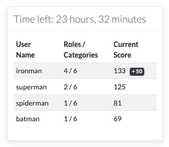
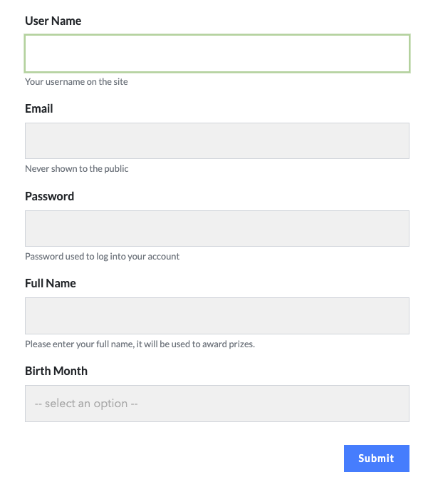
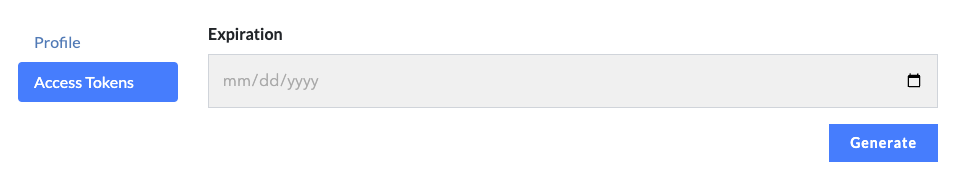
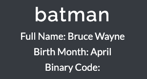
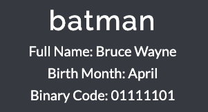
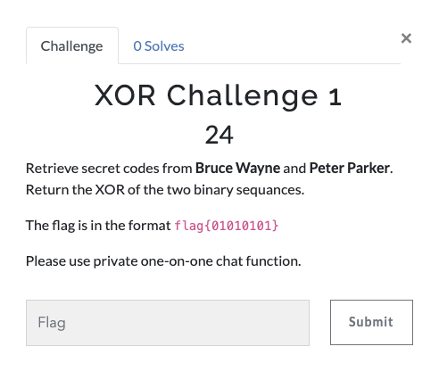

## CTFd for Edu

Codes for checking new user and add new challenges using API

before running, login in to CTFd as admin user, go to the settings page. Then, select a future time and generate a authentication token to use the API.

***This repository is not for general CTF, it is dedicated for the situation mentioned in this research paper: [10.1109/EDUCON52537.2022.9766724](https://doi.org/10.1109/EDUCON52537.2022.9766724)***

# auto-scoreboard plugin
Inspired by ctfd-event-countdown from https://github.com/alokmenghrajani/ctfd-event-countdown
Altered for special needs.

The plugin shows a scoreboard, and a countdown until the start of the event and then until the end of the event. The scoreboard also summarizes all user's category attempts.

## Screenshot




## To use

1. Clone the official CTFd repository at [here](https://github.com/CTFd/CTFd). When finished, don't change directory. Clone this repository to **the same directory where your CTFd is**. Run the **run_first.py**
2. It first creates a ``.ctfd_secret_key file`` which is required by the next step.
3. Then, it checks the total number of CPU cores, and calculate the optimal total number of workers. Then, it changes the setting. 
````
number_of_workers = 2*number_of_CPUs+1
````
4. The program will add to the following to base template (`themes/core/templates/base.html` if you are using the default theme. It will not work for other themes):
```
<meta name="start_in" content="{{ ctf_starts_in() }}">
<meta name="ends_in" content="{{ ctf_ends_in() }}">
```
5. It then adds the following code right before the line with `id=challenge-window` in `themes/core/templates/challenges.html`. Feel free to manually add on any other pages.
````
<span class="ctfd-auto-scoreboard" style="position: relative; float: right; top: 0px; right: 0px; min-width: 20%;">&nbsp;</span>
````
6. Next, it copies the **ctfd-auto-scoreboard** plugin to the plugins folder
7. Go to the host address to initialize the CTFd platform.
8. Once done, go to `Admin Panel`--> `Config`-->`Custom Fields`, create the following fields in its order as stated. The program will not work if order got messed up. Make sure to press the **save** button for each field created:
````
first:
Field Type: Text Field
Field Name: Full Name
Field Description: Please enter your real full name. It will be used for prizes. 
Options: check "Required on registration"

second:
Field Type: Text Field
Field Name: Birth Month
Field Description: (leave empty)
Options: check "Required on registration"

third:
Field Type: Text Field
Field Name: Binary Code
Field Description: (leave empty)
Options: (do not check anything)
````
This will add the Full name and birth month fields to the registration page.



9. When setting up the event time, set start and end time here or change it in `Admin` -> `Config` page.
10. A token is needed before running the `add_xor_challenge` and `add_birth_challenge` program. To do that, login as admin, then go to `Settings`-->`access tokens`-->select a time-->`Generate`. If you don't select a time, it will default to expire in a month.



11. Copy the token, and change the variable `token` in the `add_xor_challenge.py` and `add_birth_challenge` file. The program will alarm you if the token or IP address is incorrect.

12. After executing the `add_xor_challenge` program, it will add binary codes to each player and create XOR challenges. 
 
From  to 

The program will run in an infinite loop which dynamically generate new challenges for each new player joined in. 


